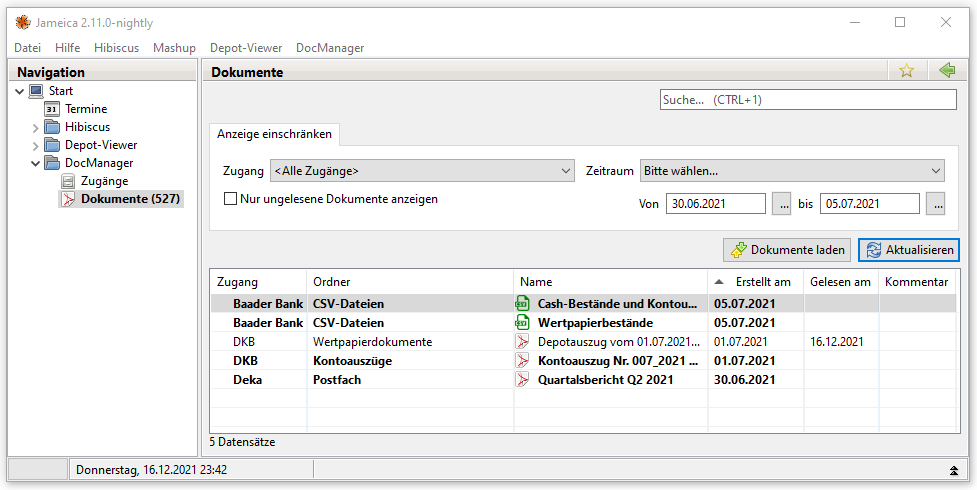

hibiscus.docmanager
====================

Plugin zum Verwalten von Dokumenten in Jameica / Hibiscus

# Features
* Abruf von Dokumenten von den Webseiten der unterstützen Institute.
* Sortierung / Filterung der Dokumente
* Einbindung in die Suche von Jameica (Über Strg+1 erreichbar)

# Unterstützte Institute
* Deutsche Kreditbank (DKB)
* DekaBank

# Installation
Voraussetzung ist Hibiscus in Version 2.10 oder neuer

## Plugin installieren
* Menü Datei / Einstellungen
* Reiter "Updates"
* Falls hier `https://faiteanu.github.io/hibiscus.docmanager` noch nicht aufgeführt ist:
    * Neues Repository hinzufügen
    * `https://faiteanu.github.io/hibiscus.docmanager` in die Textbox eintragen
    * Schließen
* Im Auswahlfeld `https://faiteanu.github.io/hibiscus.docmanager` wählen
* Die Installation des gewünschten Plugins durch Klick auf `Installieren...` beginnen
* Hibiscus neu starten

## Nach der Installation
Über den Menüpunkt "DocManager / Zugänge" kann ein neuer Zugang eingerichtet werden.

# Lizenz
Die Anfänge des Programmes basieren auf dem Beispiel Plugin für Jameica und Hibiscus von Olaf Willuhn.

Attribution-NonCommercial-ShareAlike 4.0 International (CC BY-NC-SA 4.0) - [https://creativecommons.org/licenses/by-nc-sa/4.0/](https://creativecommons.org/licenses/by-nc-sa/4.0/)

## Sie dürfen:
Teilen — das Material in jedwedem Format oder Medium vervielfältigen und weiterverbreiten
Bearbeiten — das Material remixen, verändern und darauf aufbauen
Der Lizenzgeber kann diese Freiheiten nicht widerrufen solange Sie sich an die Lizenzbedingungen halten.

## Unter folgenden Bedingungen:
Namensnennung — Sie müssen angemessene Urheber- und Rechteangaben machen, einen Link zur Lizenz beifügen und angeben, ob Änderungen vorgenommen wurden. Diese Angaben dürfen in jeder angemessenen Art und Weise gemacht werden, allerdings nicht so, dass der Eindruck entsteht, der Lizenzgeber unterstütze gerade Sie oder Ihre Nutzung besonders.

Nicht kommerziell — Sie dürfen das Material nicht für kommerzielle Zwecke nutzen.

Weitergabe unter gleichen Bedingungen — Wenn Sie das Material remixen, verändern oder anderweitig direkt darauf aufbauen, dürfen Sie Ihre Beiträge nur unter derselben Lizenz wie das Original verbreiten.

Keine weiteren Einschränkungen — Sie dürfen keine zusätzlichen Klauseln oder technische Verfahren einsetzen, die anderen rechtlich irgendetwas untersagen, was die Lizenz erlaubt.

## Hinweise:
Sie müssen sich nicht an diese Lizenz halten hinsichtlich solcher Teile des Materials, die gemeinfrei sind, oder soweit Ihre Nutzungshandlungen durch Ausnahmen und Schranken des Urheberrechts gedeckt sind.
Es werden keine Garantien gegeben und auch keine Gewähr geleistet. Die Lizenz verschafft Ihnen möglicherweise nicht alle Erlaubnisse, die Sie für die jeweilige Nutzung brauchen. Es können beispielsweise andere Rechte wie Persönlichkeits- und Datenschutzrechte zu beachten sein, die Ihre Nutzung des Materials entsprechend beschränken.
